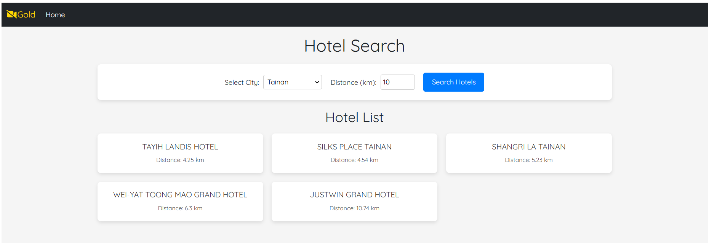
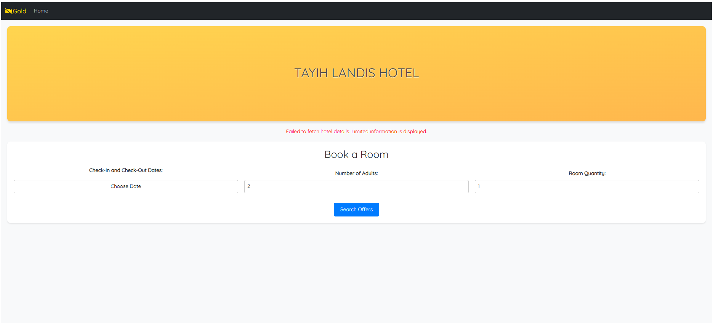
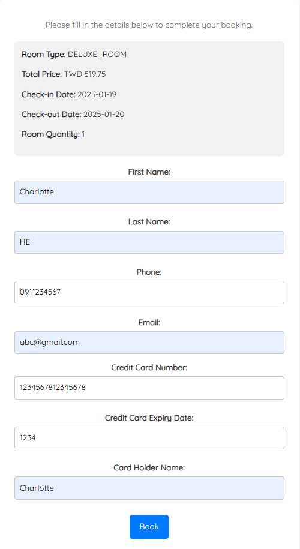
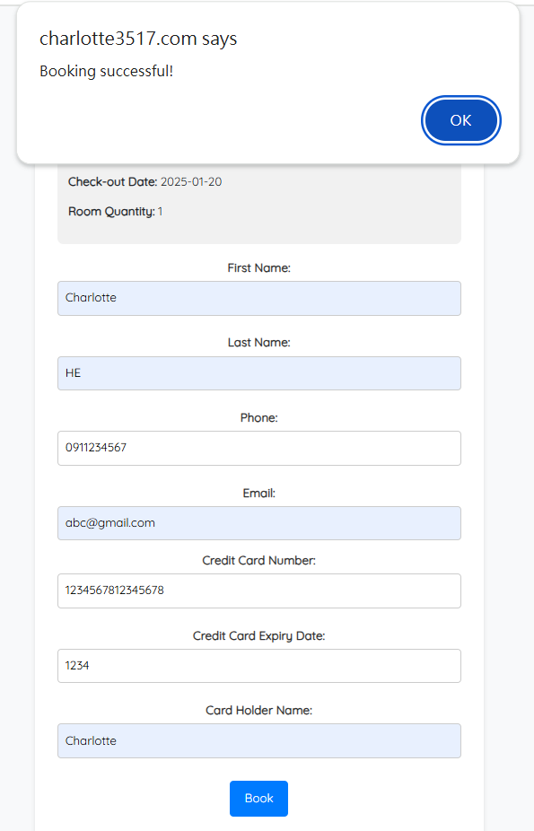

# Hotel Booking Frontend

This project is a frontend application for a hotel booking platform,  
built using React and hosted on AWS ECS with Fargate.   
It integrates with Amadeus API for hotel availability and Google Places API for reviews.  
While currently connected to Amadeus's testing environment,  
this platform is designed to support real-time booking data when connected to the production environment.

View Project: http://charlotte3517.com

## Features

- **Hotels Search By City**: Select a city and distance to search for hotels from Amadeus API, and click a hotel.  
  → Example: Quickly find hotels in your desired location with customizable search distances.
- **Hotel Details and Book a Room**: Enter a hotel name to search for Google Maps reviews. Input date, number of adults, and room quantity.  
  Dynamic integration ensures up-to-date reviews and booking options.  
  Failed to fetch hotel details: If hotel details cannot be fetched, the system will display limited information while still allowing users to complete bookings.
- **Fill in credit card details**: Simulate credit card input for booking purposes.  
  *Note: This feature is for demonstration only and does not implement security measures for sensitive data.*
- **Booking Confirmation**: View the booking confirmation.

## Tech Stack

- **Frontend Framework**: React
- **Hosting**: Frontend hosted on AWS ECS (Fargate), Docker images stored in AWS ECR
- **Domain Management**: Domain registered with AWS Route 53

## Prerequisites

- Node.js (version 16.13.2 or above)
- npm (version 6 or above)
- Docker 

## Website Introduction

- **Hotels Search By City**: Select a city and distance to search for hotels from Amadeus API, and click a hotel.  
  → Example: Quickly find hotels in your desired location with customizable search distances.

    Screenshot: User interface for searching hotels by city and distance, displaying the list of available options dynamically.

- **Hotel Details and Book a Room**: Enter a hotel name to search for Google Maps reviews. Input date, number of adults, and room quantity.  
  Dynamic integration ensures up-to-date reviews and booking options.  
  Failed to fetch hotel details: If hotel details cannot be fetched, the system will display limited information while still allowing users to complete bookings.

    Screenshot: Input hotel order details interface.

    Screenshot: Input hotel order details interface (Displayed when hotel reviews cannot be fetched from the Google Places API).

- **Fill in credit card details**: Simulate credit card input for booking purposes.  
  *Note: This feature is for demonstration only and does not implement security measures for sensitive data.*

    Screenshot: Input credit card interface.

- **Booking Confirmation**: View the booking confirmation.

    Screenshot: Booking Confirmation interface.

