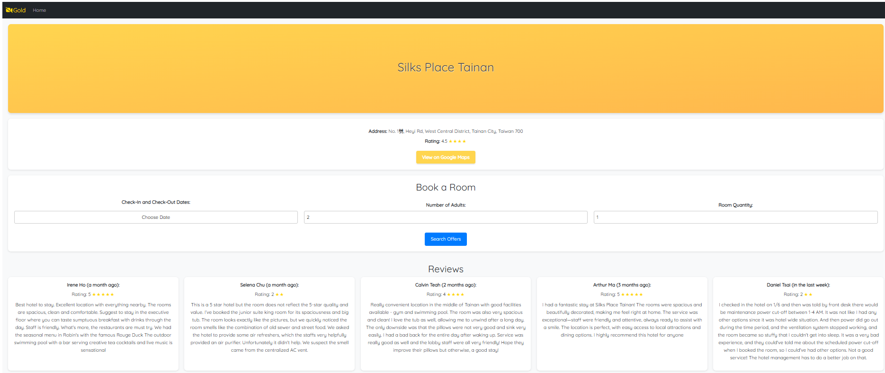

# Hotel Booking Frontend

This is the frontend of the Hotel Booking website, built using React and hosted on AWS ECS with Fargate. 
The application allows users to search for hotel reviews using the Google Places API, select room types, book rooms, and view booking confirmations.

View Project: http://charlotte3517.com

## Features

- **Hotel Search**: Enter a hotel name to search for Google Maps reviews.
- **Room Selection**: Choose room types and dates, with automatic total calculation.
- **Booking Confirmation**: View the booking confirmation and order details.

## Tech Stack

- **Frontend Framework**: React
- **Hosting**: Frontend hosted on AWS ECS (Fargate), Docker images stored in AWS ECR
- **Domain Management**: Domain registered with AWS Route 53

## Prerequisites

- Node.js (version 16.13.2 or above)
- npm (version 6 or above)
- Docker 

## Website Introduction

- **Hotel Search**: Enter a hotel name to search for Google Maps reviews.

    Above: Hotel Search interface.
- **Room Selection**: Choose room types and dates, with automatic total calculation.

    Above: Room Selection interface showing available room types.

    Above: Room Booking interface with total price calculation.

- **Booking Confirmation**: View the booking confirmation and order details.

    Above: Booking Confirmation interface showing order details.

